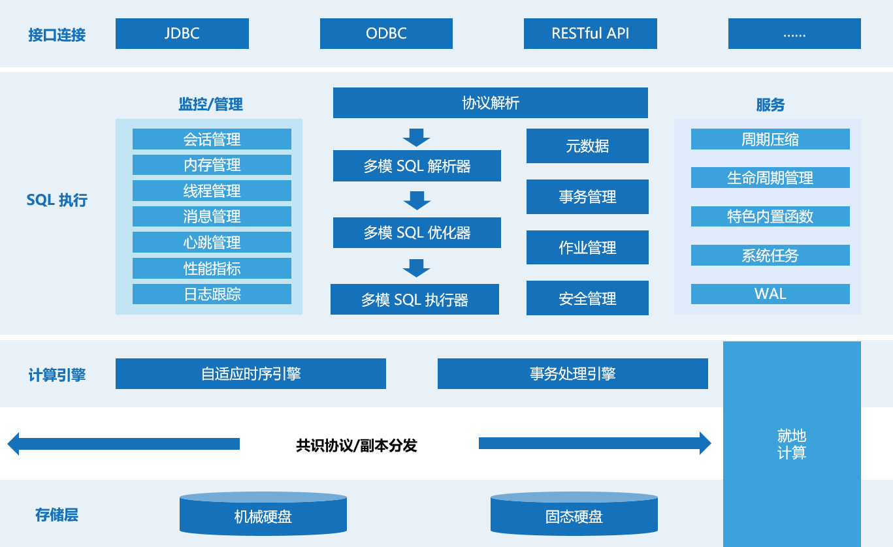

# KWDB

简体中文 | [English](./README.en.md)

## 了解 KWDB

KWDB 是一款**面向 AIoT 场景的分布式多模数据库**产品，支持在同一实例同时建立时序库和关系库并融合处理多模数据，具备千万级设备接入、百万级数据秒级写入、亿级数据秒级读取等时序数据高效处理能力，具有稳定安全、高可用、易运维等特点。



KWDB 基于浪潮 KaiwuDB 分布式多模数据库研发开源，典型应用场景包括但不限于物联网、能源电力、交通车联网、智慧政务、IT 运维、金融证券等，旨在为各行业领域提供一站式数据存储、管理与分析的基座，助力企业数智化建设，以更低的成本挖掘更大的数据价值。

KWDB 为不同角色开发者提供以下支持（包括但不限于）：

- 为开发者提供通用连接接口，具备高速写入、极速查询、SQL 支持、随需压缩、数据生命周期管理、集群部署等特性，与第三方工具无缝集成，降低开发及学习难度，提升开发使用效率。
- 为运维管理人员提供快速安装部署、升级、迁移、监控等能力，降低数据库运维管理成本。

 **关键词**：物联网（IoT）、多模数据库、分布式、时序数据处理、云边端协同

## 资源下载

**获取资源**：拥有 Gitee 账户的用户登陆后可以直接访问并下载本社区的资源，资源类型包括文章、文档、源代码、二进制可执行文件。

**使用资源**：用户可以直接使用下载的资源。KWDB 文章和文档的引用应当注明来源；源代码的修改应当遵守 [MulanPSL2](http://license.coscl.org.cn/MulanPSL2) 协议约束；二进制文件使用过程中遇到的问题，可通过 [Issue 提报](https://gitee.com/kwdb/kwdb/issues)的方式反馈给社区。

## 编译和安装

KWDB 支持用户根据需求选择二进制安装包、容器和源码安装与试用 KWDB 数据库：

- **二进制安装包**：支持单机和集群以及安全和非安全部署模式，更多信息见[单节点部署](https://kaiwudb.com/kaiwudb_docs/#/quickstart/install-kaiwudb/quickstart-bare-metal.html)和[集群部署](https://kaiwudb.com/kaiwudb_docs/#/deployment/overview.html)。
- **容器镜像**：KWDB 暂未提供可供下载的容器镜像，如需以容器方式部署 KWDB， 请联系 [KWDB 技术支持人员](https://kaiwudb.com/support/)。
- **源码**：源码编译目前支持单节点非安全模式部署。

以下指南以 Ubuntu 22.04 操作系统为例说明如何编译源码和安装 KWDB。

### 操作系统和软件依赖

KWDB 支持在 Linux 操作系统进行安装部署，下表列出了编译和运行 KWDB 所需的软件依赖。

**编译依赖：**

| 依赖              | 版本    | 说明                                                         |
| :---------------- | :------ | ------------------------------------------------------------ |
| ca-certificates   | any     |                                                              |
| Go                | v1.15+  |                                                              |
| CMake             | v3.23   |                                                              |
| Autoconf          | v2.68+  |                                                              |
| goyacc            | v0.8.0+ |                                                              |
| dpkg-dev          | any     | 仅适用Ubuntu系统。                                           |
| devscripts        | any     | 仅适用Ubuntu系统。                                           |
| build-essential   | any     |                                                              |
| checkinstall      | any     |                                                              |
| libssl            | v1.1.1+ | - Ubuntu系统该依赖名为libssl-dev。<br/>- RHEL, CentOS, Kylin, UOS, AnolisOS系统该依赖名为libssl-devel。 |
| libprotobuf       | v3.6.1+ | - Ubuntu系统该依赖名为libprotobuf-dev。<br/>- RHEL, CentOS, Kylin, UOS, AnolisOS系统该依赖名为libprotobuf-devel。 |
| liblzma           | v5.2.0+ | - Ubuntu系统该依赖名为liblzma-dev。<br>- RHEL, CentOS, Kylin, UOS, AnolisOS系统该依赖名为liblzma-devel。 |
| libncurses        | v6.2.0+ | - Ubuntu系统该依赖名为libncurses5-dev。<br>- RHEL, CentOS, Kylin, UOS, AnolisOS系统该依赖名为libncurses-devel。 |
| libatomic         | v7.3.0+ | 仅 GCC 和 G++ 7.3.0 版本需要增加此依赖。                     |
| libstdc++-static  | v7.3.0+ | 仅 GCC 和 G++ 7.3.0 版本需要增加此依赖。                     |
| protobuf-compiler | any     |                                                              |
| git               | any     |                                                              |

**运行依赖：**

| 依赖           | 版本    |
| :-------------| :------ |
| openssl        | v1.1.1+ |
| protobuf       | v3.5.0+ |
| geos           | v3.3.8+ |
| xz-libs        | v5.2.0+ |
| squashfs-tools | any     |
| libgcc         | v7.3.0+ |
| mount          | any     |
| squashfuse     | any     |

### 环境准备

1. 下载和解压 [CMake 安装包](https://cmake.org/download/)。

   ```Bash
   tar -C /usr/local/ -xvf cmake-3.23.4-linux-x86_64.tar.gz 
   mv /usr/local/cmake-3.23.4-linux-x86_64 /usr/local/cmake
   ```

2. 下载和解压 [Go 安装包](https://golang.google.cn/dl/)。

   ```Bash
   tar -C /usr/local -xvf go1.22.5.linux-amd64.tar.gz
   ```

3. 创建用于存放项目代码的代码目录。

   ```Bash
   mkdir -p /home/go/src/gitee.com
   ```

4. 设置 Go 和 CMake 的环境变量。

   - 个人用户设置：修改`~/.bashrc` 文件
   - 系统全局设置（需要 root 权限）：修改`/etc/profile`文件
      ```Bash
      export GOROOT=/usr/local/go
      export GOPATH=/home/go      #请以实际代码下载存放路径为准，在此以home/go目录为例
      export PATH=$PATH:/usr/local/go/bin:/usr/local/cmake/bin
      ```

5.  使变量设置立即生效：

    - 个人用户设置：
      ```Bash
      source ~/.bashrc                           
      ```
    - 系统全局设置：
      ```Bash
      source /etc/profile                           
      ```

### 下载代码

在 [KWDB 代码仓库](https://gitee.com/kwdb/kwdb)下载代码，并将其存储到 `GOPATH` 声明的目录。

- 使用 git clone 命令：
   ```Bash
   git clone https://gitee.com/kwdb/kwdb.git /home/go/src/gitee.com/kwbasedb #请勿修改目录路径中的 src/gitee.com/kwbasedb
   cd /home/go/src/gitee.com/kwbasedb 
   git submodule update --init  #适用于首次拉取代码
   git submodule update --remote
   ```

- 下载代码压缩包，并将其解压缩到指定目录。

### 构建和安装

1. 在项目目录下创建并切换到构建目录。

   ```Bash
   cd /home/go/src/gitee.com/kwbasedb
   mkdir build && cd build
   ```

2. 运行 CMake 配置。
   
   ```Bash
   cmake .. -DCMAKE_BUILD_TYPE= [Release | Debug]
   ```

   参数说明：
   `CMAKE_BUILD_TYPE`：指定构建类型，默认为 `Debug`。可选值为 `Debug` 或 `Release`，首字母需大写。

3. 禁用Go模块功能。

   1. 设置环境变量

      - 个人用户设置：修改`~/.bashrc` 文件

      - 系统全局设置（需要 root 权限）：修改`/etc/profile`文件

         ```Bash
         export GO111MODULE=off
         ```

   2. 使变量设置立即生效：

      - 个人用户设置：

         ```Bash
         source ~/.bashrc                           
         ```

      - 系统全局设置：

        ```Bash
        source /etc/profile                           
        ```

4. 编译和安装项目。

   > **提示**：
      如果编译时出现遗留的 protobuf 自动生成的文件导致报错，可使用`make clean` 清理编译目录。

      ```Bash
      make
      make install
      ```
   编译和安装成功后的文件清单如下：

      ```Plain
      /home/go/src/gitee.com/kwbasedb
      ├── install
      │   ├── bin
      │   │   ├── err_inject.sh
      │   │   ├── query_kwbase_status.sh
      │   │   ├── query_status.sh
      │   │   ├── setup_cert_file.sh
      │   │   ├── utils.sh
      │   │   └── kwbase
      │   └── lib
      │       ├── libcommon.so
      │       └── libkwdbts2.so
      ```

5. （可选）进入 kwbase 脚本所在目录，查看数据库版本，验证是否安装成功。

      ```Bash
      ./kwbase version
      KaiwuDB Version:  V2.0.3.2_RC3-3-gfe5eeb853e-dirty
      Build Time:       2024/07/19 06:24:00
      Distribution:
      Platform:         linux amd64 (x86_64-linux-gnu)
      Go Version:       go1.22.5
      C Compiler:       gcc 11.4.0
      Build SHA-1:      fe5eeb853e0884a963fd43b380a0b0057f88fb19
   ```

### 启动数据库

1. 进入 `kwbase` 脚本所在目录。

   ```Bash
   cd /home/go/src/gitee.com/kwbasedb/install/bin
   ```

2. 设置共享库的搜索路径。

   ```Bash
   export LD_LIBRARY_PATH=../lib
   ```

3. 启动数据库。

   ```Bash
   ./kwbase start-single-node --insecure --listen-addr=:26257 --background
   ```

4. 数据库启动后即可通过 kwbase CLI 工具、KaiwuDB 开发者中心或 JDBC 等连接器连接和使用 KWDB，具体连接和使用内容见[使用 kwbase CLI 工具连接 KWDB](https://gitee.com/kwdb/docs/blob/master/quickstart/access-kaiwudb/access-kaiwudb-cli.md)、[使用 KaiwuDB 开发者中心连接 KWDB ](https://gitee.com/kwdb/docs/blob/master/quickstart/access-kaiwudb/access-kaiwudb-kdc.md)和[使用 JDBC 连接 KWDB](https://gitee.com/kwdb/docs/blob/master/quickstart/access-kaiwudb/access-kaiwudb-jdbc.md)。

## 社区

### 社区组织

欢迎各位开发者加入我们的社区组织，详情请参阅我们的[社区组织架构](https://gitee.com/kwdb/community#社区组织架构)。

### 社区贡献

欢迎大家参与贡献，详情请参阅我们的[社区贡献](https://gitee.com/kwdb/community/blob/master/Contribute_process.md)。

## 案例

KWDB 典型应用场景包括但不限于物联网、能源电力、交通车联网、智慧政务、IT 运维、金融证券等，更多信息请参见[应用案例](https://gitee.com/link?target=https%3A%2F%2Fkaiwudb.com%2Fcase%2F)。

## 发版说明

请参见[发版说明](https://gitee.com/kwdb/docs/blob/master/release-notes/release-notes.md)。

## 许可证

[MulanPSL2](http://license.coscl.org.cn/MulanPSL2)

## 联系我们

### 加入技术交流群

如果你想和更多 KWDB 的用户互动交流，请扫下方二维码（备注：Gitee），KWDB 官方小助手将协助你加入官方技术交流群。


### KaiwuDB 账号

官网：https://www.kaiwudb.com/

扫码关注公众号：KaiwuDB

